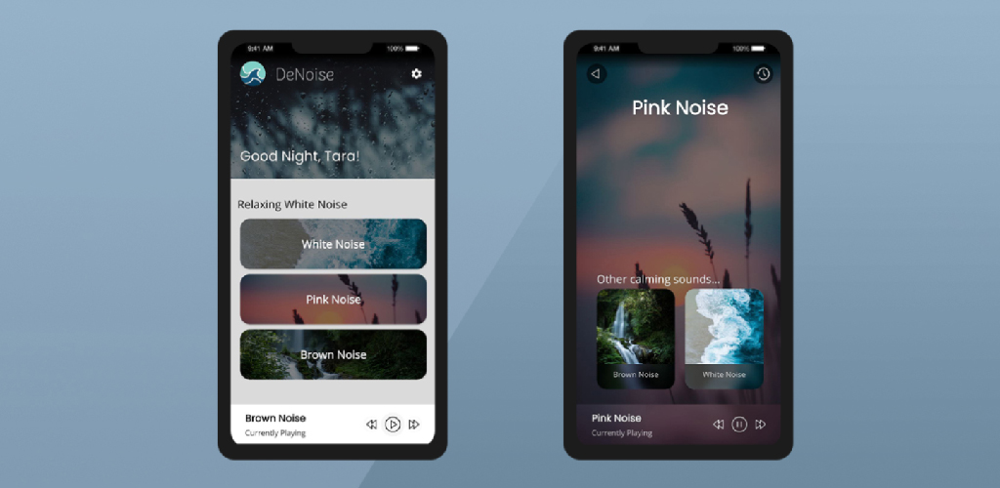
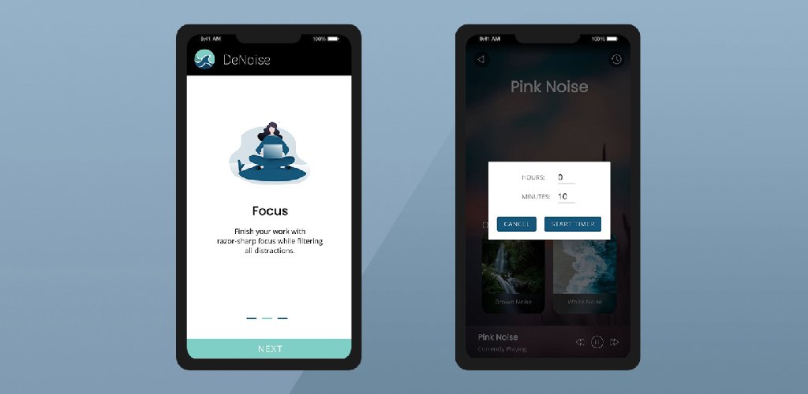
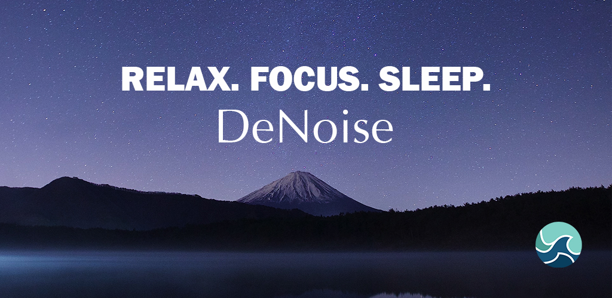

# DeNoise - White Noise Application

DeNoise - White Noise Application for relaxation, studying or sleeping, made in Android Studio.

The application supports both **light and dark theme**, as well as **multiple languages**. Pleasently designed, it allows its users to listen to calming white/pink/brown noise sounds to relax, focus or help with sleep. A timer can be sey up, which will automatically turn off the sounds after the predetermined time has passed.

I plan on releasing this application on Play Store, as well as working on its expantion in forms of multiple new sounds (rain, beach, fireplace, etc.) and aditional custimization. 

# Google Play Release

https://play.google.com/store/apps/details?id=com.tarapogancev.denoise&hl=en&gl=US

## Sound List

 1. White Noise
 2. Brown Noise
 3. Pink Noise
 4. Calming Rain
 5. Beach Waves
 6. Relaxing Forest
 7. Distant Shore

## Resources

https://www.flaticon.com/packs/music-224?word=music%20player

https://unsplash.com/

https://themeisle.com/illustrations/

https://mixkit.co/

## Screenshots

